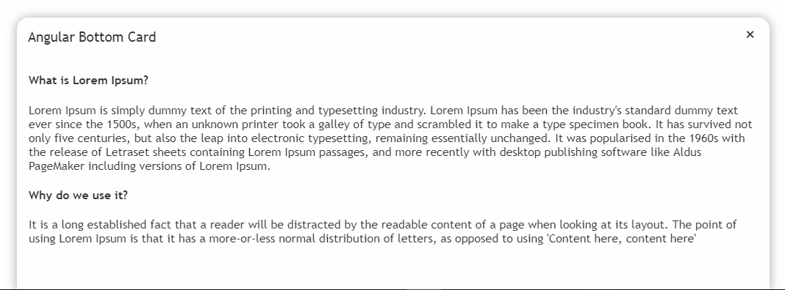
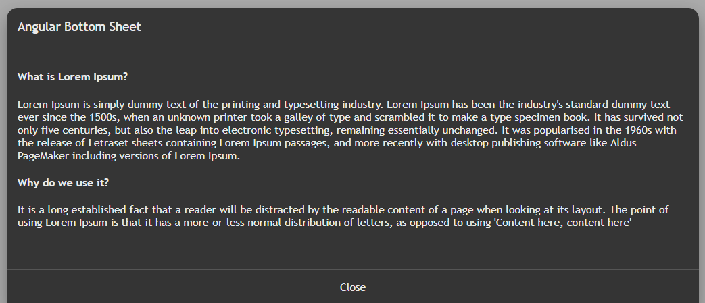

# Angular Bottom Sheet

Angular Bottom Sheet [Demo](http://rahulprabhakar.in/angular-bottom-sheet/)

Requires Angular 7.x


## Install

``npm i angular-bottom-sheet``

## Usage

First, import AngularBottomSheetModule to your module

```javascript
import { BrowserModule } from '@angular/platform-browser';
import { NgModule } from '@angular/core';
import { AngularBottomSheetModule } from 'angular-bottom-sheet';
import { AppComponent } from './app.component';

@NgModule({
  declarations: [
    AppComponent
  ],
  imports: [
    BrowserModule,
    AngularBottomSheetModule
  ],
  providers: [],
  bootstrap: [AppComponent]
})
export class AppModule { }

```
Add the following component tag in you template.

```html
<button (click)="openBottomSheet()"></button><!-- Toggle bottom sheet -->

<angular-bottom-sheet [options]="options" #bottomSheet>
    <!-- Your content goes here -->
</angular-bottom-sheet>
```


Declare the options in your component where you want to consume the bottom sheet component.

```javascript
import { Component, ViewChild } from '@angular/core';
import { AngularBottomSheetComponent, AngularBottomSheetConfig } from 'angular-bottom-sheet';


@Component({
  selector: 'app-root',
  templateUrl: './app.component.html',
  styleUrls: ['./app.component.css']
})
export class AppComponent {
  @ViewChild('bottomSheet') bottomSheet: AngularBottomSheetComponent;
  options: AngularBottomSheetConfig;

  openBottomSheet() {
    this.bottomSheet.open();
  }

  ngOnInit(){
    this.options = {
      title:"Angular Bottom Sheet",
      backgroundColor: "#ffffff", 
      fontColor: "#363636" 
    }
  }
}

```
## Screenshot 






### Settings
The following list of settings are supported by the component. Configure the options to meet your requirement.

| Setting         |Type    | Description            | Default Value |
|:--- |:--- |:--- |:--- |
| title | String | To set the title for the bottom sheet component. | "" |
| backgroundColor | String | To set the background color of the bottom sheet component. | "#fff" |
| fontColor | String | To set the font color of the bottom sheet component. | "#363636" |
| enableCloseButton | Boolean | To enable the close button in bottom sheet component. | false |
| closeButtonTitle | String | To set the value for close button in bottom sheet component. | "Close" |
| darkTheme | Boolean | To enable the dark theme in the bottom sheet component. | false |

### Events
- `open()` - opens the bottom sheet component.
    
    Example : `this.bottomSheet.open()`"
- `close()` - closes the bottom sheet component.
    
    Example : `this.bottomSheet.close()`"
- `toggle()` - toggles the bottom sheet component between open and close states.
    
    Example : `this.bottomSheet.toggle()`"

